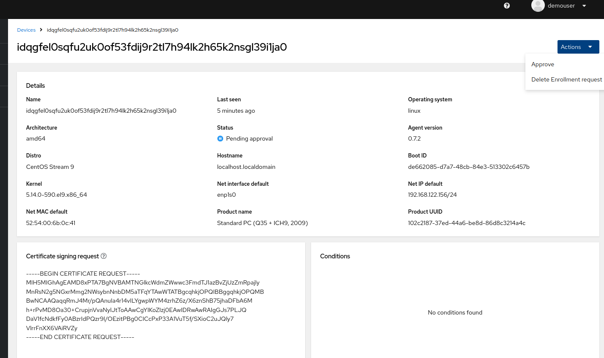
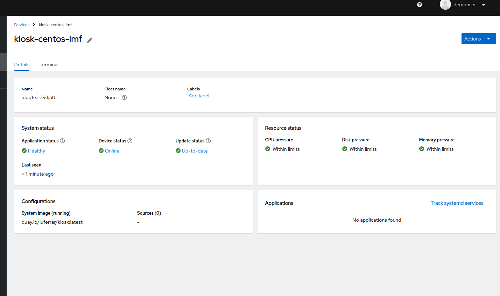
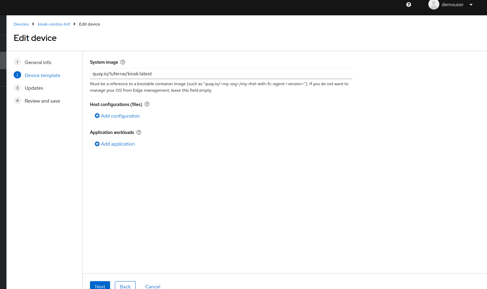
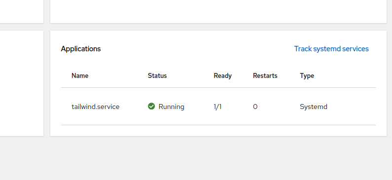

# Running the second demo at devconf.cz keynote 2025

Install kind and kubectl cli tools.

Deploy kind on a system in rootless mode with:

`$ systemd-run --scope --user -p "Delegate=yes" kind create cluster --config kind.yaml`

Verify the cluster is up and running:
```
$ kubectl get pods -A
NAMESPACE        	NAME                                     	READY   STATUS	RESTARTS   AGE
kube-system      	coredns-668d6bf9bc-6j97q                 	1/1 	Running   0      	2m44s
kube-system      	coredns-668d6bf9bc-nsvsb                 	1/1 	Running   0      	2m44s
kube-system      	etcd-kind-control-plane                  	1/1 	Running   0      	2m49s
kube-system      	kindnet-gkxd2                            	1/1 	Running   0      	2m44s
kube-system      	kube-apiserver-kind-control-plane        	1/1 	Running   0      	2m49s
kube-system      	kube-controller-manager-kind-control-plane  1/1 	Running   0      	2m49s
kube-system      	kube-proxy-94gkd                         	1/1 	Running   0      	2m44s
kube-system      	kube-scheduler-kind-control-plane        	1/1 	Running   0      	2m49s
local-path-storage  local-path-provisioner-7dc846544d-7mzbq  	1/1 	Running   0      	2m44s
```

Deploy Flight Control on Kind with

```
$ helm upgrade --install --version=0.7.1 \
	--namespace flightctl --create-namespace \
	flightctl oci://quay.io/flightctl/charts/flightctl \
	--set global.baseDomain=<YOUR-SYSTEM-A-IP ADDRESS>.nip.io \
	--set global.exposeServicesMethod=nodePort
```
Make sure Flight Control platform is running:
```
$ kubectl get pods -n flightctl
NAME                              	READY   STATUS  	RESTARTS    	AGE
flightctl-api-85945b9d9f-hldm5    	1/1 	Running 	1 (2m46s ago)   6m18s
flightctl-db-5c68587f4d-6z4tw     	1/1 	Running 	0           	6m18s
flightctl-kv-0                    	1/1 	Running 	0           	6m18s
flightctl-periodic-8595f8db48-d8kh8 1/1 	Running 	0           	6m18s
flightctl-secrets-bkrjj           	0/1 	Completed   0           	6m18s
flightctl-ui-867568898-fkktq      	1/1 	Running 	2 (36s ago) 	6m18s
flightctl-worker-64cb8947b8-tn7kv 	1/1 	Running 	1 (37s ago) 	6m18s
keycloak-74f56c76fd-665s8         	1/1 	Running 	4 (2m9s ago)	6m18s
keycloak-db-0                     	1/1 	Running 	0           	6m18s
```
In case the flight-ui pod is crashing delete it with

`$ kubectl delete pod -n flightctl flight-ui-.....`

You should now be able to open the relevant web page for Flight Control (after opening the dedicated firewall port on system A).
```
$ sudo firewall-cmd --zone=public --add-port=9000/tcp --permanent
success
$ sudo firewall-cmd --zone=public --add-port=3443/tcp --permanent
success
$ sudo firewall-cmd --zone=public --add-port=7443/tcp --permanent
success
$ sudo firewall-cmd --zone=public --add-port=8081/tcp --permanent
success
$ sudo firewall-cmd –reload
```
Navigate to `http://<YOUR-SYSTEM-A-IP-ADDRESS>.nip.io:9000`

Once you open the page you will get redirected to the authentication page (as Flight Control comes with a preconfigured [IDP](https://www.keycloak.org/)).

You can get the password for the default user demouser like this:

`$ kubectl get secret -n flightctl keycloak-demouser-secret -o=jsonpath='{.data.password}' | base64 -d`

Login to your Flight Control instance with 

```
$ flightctl login https://192.168.1.48.nip.io:3443 --insecure-skip-tls-verify --username demouser --password your-password-here
```

Generate the config.yaml that includes public key to authenticate the device you are going to enroll

```
$ flightctl certificate request --signer=enrollment --expiration=365d --output=embedded > config.yaml

```

Now you can generate the first bootc image with Podman (you will find Containerfilev1 and Containerfilev2 in this same folder)

```
$ sudo podman build -t quay.io/luferrar/kiosk:latest -f Containerfilev1 
```

Push image to quay and build the ISO with 

```
$ sudo podman push quay.io/luferrar/kiosk
$ sudo podman run       --rm    -it     --privileged    --pull=newer    --security-opt label=type:unconfined_t  -v /var/lib/containers/storage:/var/lib/containers/storage         -v $(pwd)/config.toml:/config.toml      -v $(pwd)/output:/output        quay.io/centos-bootc/bootc-image-builder:latest         --type qcow2  --use-librepo=True   --config /config.toml  quay.io/luferrar/kiosk:latest
```


Make sure you have KVM installed on the system where you will run the bootc virtualized device with (in this case for Fedora):

```
$ sudo dnf group install --with-optional virtualization
$ sudo systemctl enable --now libvirtd
```

## Run v1 image
Run the VM based on the created image with `virt-install` (possibly from a different machine than the one used to install Flight Control)
```
sudo virt-install \
    --name kiosk-bootc \
    --cpu host \
    --vcpus 2 \
    --memory 4096 \
    --import --disk /var/lib/libvirt/images/disk.qcow2,format=qcow2 \
	--boot uefi \
	--network network=default \
	--graphics vnc \
    --os-variant centos-stream9
```
Make sure that the device shows up on the deployed Flight Control


and after approval you will see something like this


Let's now proceed and define in the device template a target image


Let's now track also the availability of the `tailwind` container as systemd service



## Build v2 image (and automatic update with FlightCTL)
We are now going to do a "small update" and move to `centos-10-stream` with very little effort and disruption. 

Let's first create a second image based on a different base image and push it to **quay.io** with the same tag used before

```
