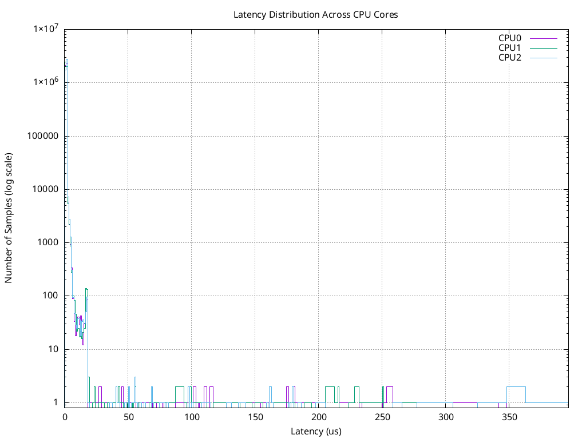
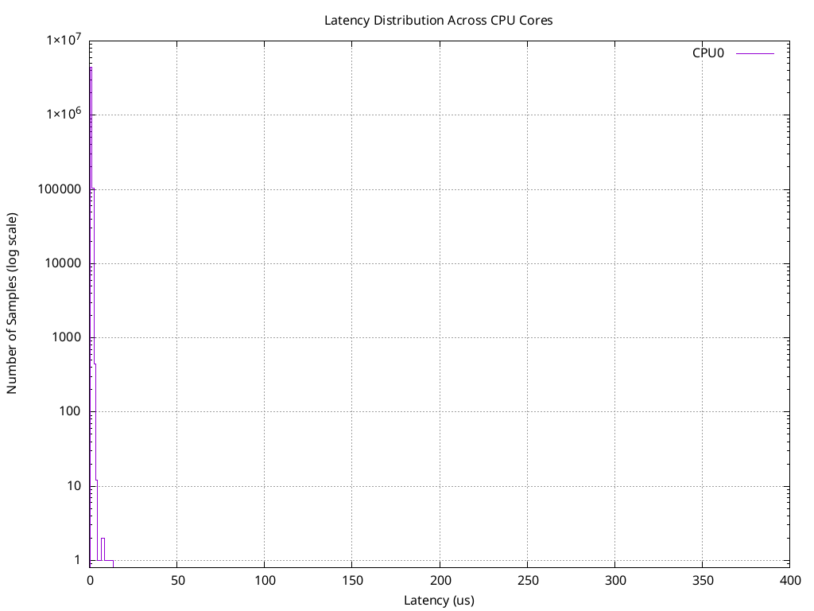
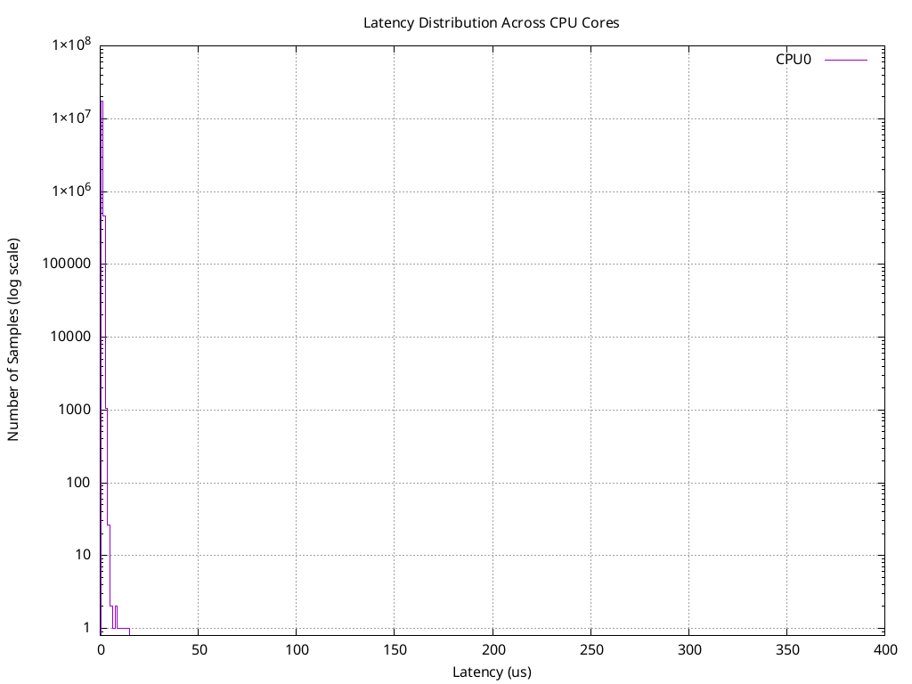
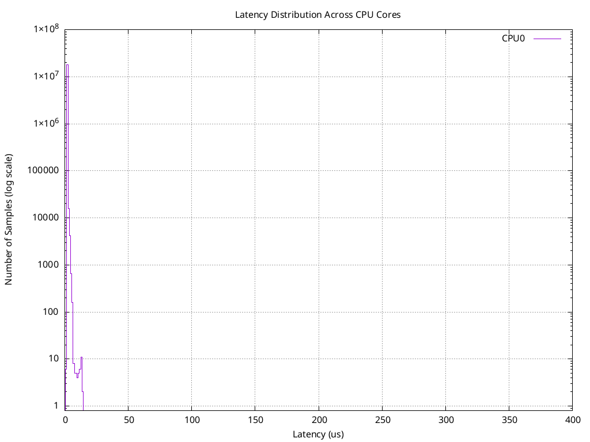
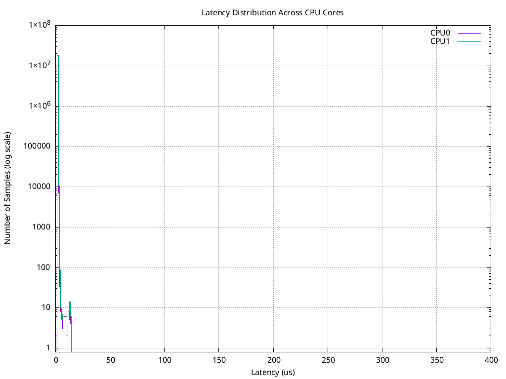
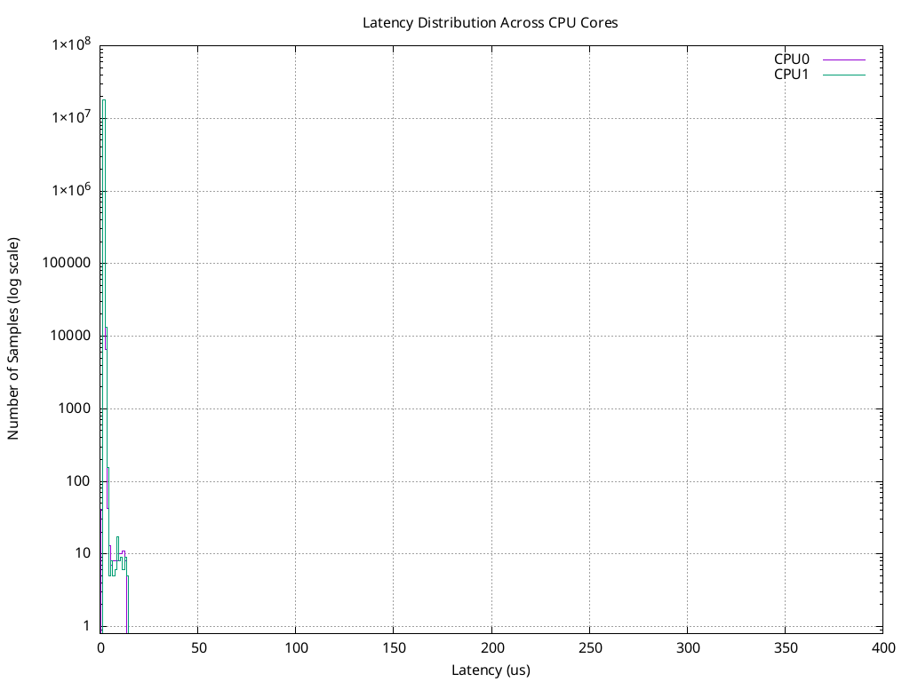
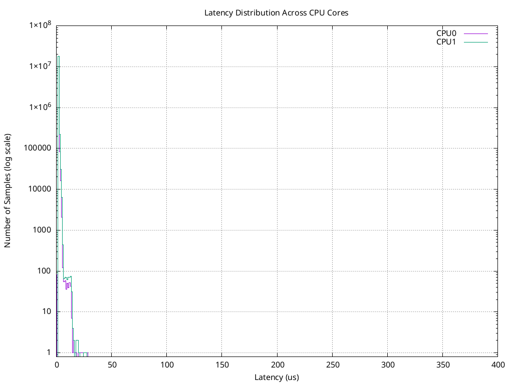

# Real-Time Bootc Container

## Overview

This `Containerfile7` creates a Real-Time (RT) optimized bootc container image for **RHEL 10**, built directly from `registry.redhat.io/rhel10/rhel-bootc:latest`. It's designed to run real-time workloads with minimal latency by installing the RT kernel and configuring the system with real-time tuning parameters. It supersedes `Containerfile2` (the RHEL 9 version of the same image).

## Main Objective

The primary goal of this container is to:
- Replace the standard Linux kernel with the **Real-Time (RT) kernel** optimized for low-latency, deterministic performance
- Install real-time tuning tools and profiles
- Configure kernel arguments specifically for real-time performance
- Enable automatic RT profile tuning on first boot
- Provide a bootc-based image for edge devices requiring real-time capabilities, including robot control

## Key Components

### 1. Real-Time Kernel Installation
- Removes the standard kernel (`kernel`, `kernel-core`, `kernel-modules`, `kernel-modules-core`)
- Installs the RT kernel: `kernel-rt-core`, `kernel-rt-modules`, `kernel-rt-modules-core`
- On RHEL 10, `dnf remove`/`dnf install` alone can leave a stale module directory behind from the
  removed kernel, which trips `bootc container lint`'s single-kernel check. Containerfile7 adds an
  explicit cleanup (`find /usr/lib/modules/ ... ! -iname '*rt*' -exec rm -rf {} +`) right after the
  swap to guarantee only the RT kernel's `/usr/lib/modules/<kver>` directory remains.

### 2. Real-Time Tools and Utilities
Installed packages include:
- **tuned**: Dynamic tuning daemon for system optimization
- **tuned-profiles-realtime**: Pre-configured real-time tuning profiles
- **realtime-tests**: Testing utilities for real-time performance (includes `cyclictest`)
- **realtime-setup**: Real-time environment setup tools (RT `limits.d`/udev rules)
- **rteval** / **rteval-loads**: Real-time evaluation benchmarking
- **rtla**: Real-Time Linux Analysis tool
- **tuna**: CPU and IRQ affinity management
- **stress-ng**: System stress testing utility, used to load the system while measuring latency
- **tmux**: Terminal multiplexer for monitoring

### 3. First-Boot Real-Time Tuning
Since tuned profiles cannot be applied during container build time, a systemd service (`rt-post-install-tuning.service`) is installed that runs on first boot to automatically apply the configured real-time profile.

### 4. Realtime Group for Non-Root RT Scheduling
`realtime-setup`'s own `%post` scriptlet creates the `realtime` group (GID 71), but on bootc/ostree
systems `/etc/passwd`/`/etc/group` are machine-local state — a group created at build time doesn't
reliably survive into the deployed system. Containerfile7 instead ships:
- `realtime-group.conf` — a `systemd-sysusers` snippet (`g realtime 71`) installed to
  `/usr/lib/sysusers.d/`, which is applied at every boot instead of at build time.
- `add-realtime-group.sh` + `realtime-group-first-boot.service` — a one-shot systemd unit that runs
  `usermod -aG realtime admin` on first boot, once the `admin` user (created by kickstart at install
  time, so it doesn't exist yet at build time) is available.

Membership in `realtime` grants the RT priority (`rtprio`) and memory-locking (`memlock`) limits
needed to run `cyclictest` and similar tools without `sudo` — see
[Real-Time Consistency Testing](#real-time-consistency-testing-cyclictest) below.

### 5. Kernel Arguments Configuration

The following kernel arguments are configured in `/usr/lib/bootc/kargs.d/` to optimize real-time performance:

#### **IOMMU Configuration** (Intel x86_64)
- **`iommu=pt`**: Sets IOMMU to passthrough mode for better I/O performance
- **`intel_iommu=on`**: Explicitly enables Intel IOMMU on x86_64 systems

#### **Memory Optimization**
- **`default_hugepagesz=1G`**: Sets default huge page size to 1GB for improved memory performance and reduced TLB (Translation Lookaside Buffer) misses

#### **CPU Latency Optimization**
- **`idle=poll`**: Disables CPU power management and idle states, keeping CPUs active for lower latency (critical for real-time workloads)

#### **Real-Time Kernel Configuration**
- **`rcutree.nocb_patience_delay=1000`**: Configures RCU (Read-Copy-Update) tree behavior for real-time performance optimization, reducing RCU callback latency
- **`rcu_nocbs=1`**: Actually offloads RCU callback processing off CPU 1 onto a housekeeping CPU — without
  this, `rcutree.nocb_patience_delay` above has nothing to act on, since no CPU is designated
  no-callback in the first place
- **`nohz_full=1`**: Enables full tickless operation on CPU 1 — once a task is the only runnable one on
  that core, the scheduling-clock interrupt stops firing entirely, removing a periodic source of jitter

#### **Serial Console Configuration**
- **x86_64**: `console=ttyS1,115200` - Configures serial console output for Intel systems
- **ARM**: `console=tty0 console=ttyAMA0,115200n81` - Configures console for ARM-based systems


## Build Arguments

- **`TARGET_PROFILE`**: Name of the tuned profile to apply (e.g., `realtime`, `realtime-virtual-guest`, `realtime-virtual-host`)
- **`RTCPU_LIST`**: Comma-separated list of CPUs to be isolated for real-time use (default: `1`)

## Build Example

```bash
podman build \
  --build-arg TARGET_PROFILE=realtime \
  -t quay.io/luferrar/part5:device007rt \
  -f Containerfile7 .
```

## Files

- **Containerfile7**: Main container definition (RHEL 10)
- **rt-tuning-first-boot.sh**: Script that applies the tuned RT profile on first boot
- **rt-post-install-tuning.service**: Systemd service that runs the tuning script on first boot
- **realtime-group.conf**: `systemd-sysusers` snippet that creates the `realtime` group
- **add-realtime-group.sh**: Script that adds the `admin` user to the `realtime` group
- **realtime-group-first-boot.service**: Systemd service that runs the group-membership script on first boot

## Performance Considerations

This image is optimized for:
- **Low latency**: Ideal for industrial automation, robotics, and time-critical applications
- **Deterministic performance**: Reduced jitter and unpredictable delays
- **High throughput**: Optimized interrupt handling and memory management
- **Edge computing**: Suitable for edge devices requiring real-time capabilities

## Use Cases

- Real-time data acquisition systems
- Industrial control systems
- Robotics and autonomous systems (this image is intended to eventually drive robots — see testing below)
- Financial trading platforms
- Telecommunications and network processing
- Audio/video processing with strict latency requirements

## Real-Time Consistency Testing (cyclictest)

Before trusting this image to drive a robot, verify it actually delivers deterministic scheduling
latency. The [`part5/rt-tests/`](../rt-tests/) directory has a ready-made `cyclictest` toolkit
(`run-cyclictest.sh`, `analyze-results.sh`, `batch-test.sh`, `test-with-load.sh`) built around the
same methodology as the
[ROS 2 Real-Time Benchmarks cyclictest guide](https://ros-realtime.github.io/ros2_realtime_benchmarks/benchmark_tools/cyclictest.html)
and the original [OSADL `mklatencyplot.bash`](https://www.osadl.org/uploads/media/mklatencyplot.bash)
script. `cyclictest` measures the gap between a thread's intended and actual wake-up time — it's the
standard sanity check to run *before* benchmarking a real robotics workload on top.

Suggested workflow once a `device007rt`-based device is deployed and enrolled:

```bash
# On the device, as the admin user (member of the realtime group — no sudo needed
# for RT priority/mlock once you've re-logged in after first boot)
cd /path/to/rt-tests

# 1. Baseline: idle system
./run-cyclictest.sh 1 200
mv cyclictest_histogram.txt baseline_histogram.txt

# 2. Loaded: stress the isolated/non-isolated CPUs while measuring
stress-ng --cpu 2 --vm 1 --vm-bytes 512M --timeout 1h &
./run-cyclictest.sh 1 200
mv cyclictest_histogram.txt loaded_histogram.txt

# 3. Compare
./analyze-results.sh baseline_histogram.txt
./analyze-results.sh loaded_histogram.txt
```

For a production robot-control workload, run a long-duration soak test (6h+) and, once the actual
control loop exists, repeat the measurement with it running instead of (or alongside) `stress-ng`, per
the "ROS2-Specific Testing" section of the `rt-tests` README.

### Test Results

Seven `cyclictest` runs (`test006`-`test010`, plus two `stress-ng`-loaded runs renumbered `test011`/
`test012` for consistency, all in [`part5/rt-tests/`](../rt-tests/)) tracing the actual tuning
progression this Containerfile went through, from no RT-specific tuning at all to the final isolated-CPU
+ RCU/tick-offload configuration it ships today, then validating that configuration under synthetic
background load. Plots and raw `cyclictest` output for all seven are in `rt-tests/`.

**Test system:** `firebat`, an Intel N100 mini-PC (4 cores, no hyperthreading, `T8_Plus` board) with
8GiB RAM. Kernel `6.12.0-211.49.1.el10_2.x86_64+rt` (RHEL10 RT kernel from this Containerfile) for
every run below. The `realtime` `tuned` profile is active; one visible effect of that is `lscpu` showing
a fixed ~800MHz clock rather than the N100's normal turbo range — `intel_pstate=disable` (injected by
the profile, not something manually set) trades peak frequency for scheduling determinism, which is
exactly the tradeoff this whole exercise is testing for.

| Test | What changed | Duration | Isolated CPU(s) | Min | Avg | Max | Overflows |
|---|---|---|---|---|---|---|---|
| test006 | No RT tuning — `isolcpus` not set, so `cyclictest` falls back to `-S` (all CPUs, unpinned) | 15m | none (0-2 measured) | 1μs | 1μs | 862μs | 17 / 20 / 12 |
| test007 | `isolcpus` set, single core, `cyclictest` pinned via `-a`/`-t` | 15m | 1 | 1μs | 1μs | 12μs | 0 |
| test008 | Same single-core pinning, extended to a full-hour soak | 60m | 1 | 1μs | 1μs | 13μs | 0 |
| test009 | Same pinning + `rcu_nocbs=1`/`nohz_full=1` added (the actual RCU/tick offload the pre-existing `rcutree.nocb_patience_delay` karg had nothing to act on without them) | 60m | 1 | 1μs | 2μs | 14μs | 0 |
| test010 | Same kargs, isolation extended to two cores (`isolcpus=...,0,1`) — this Containerfile's current shipped configuration | 60m | 2 | 1-2μs | 2μs | 14 / 14μs | 0 / 0 |
| test011 | test010's config, plus `stress-ng --cpu 1` running on the housekeeping cores for the full duration | 60m | 2 | 1-2μs | 2μs | 13 / 14μs | 0 / 0 |
| test012 | test010's config, plus `stress-ng --cpu --vm --io` at full intensity (level 4) on the housekeeping cores for the full duration | 60m | 2 | 1-2μs | 2μs | 28 / 27μs | 0 / 0 |

#### test006 — no tuning (baseline), 15 minutes



Before any CPU isolation, `run-cyclictest.sh` can't find an `isolcpus=` karg to pin against, so it
prints a warning and falls back to `-S` — one thread per visible CPU, no affinity. Three threads
(CPU0-2) ran for 15 minutes at the default 200μs interval (~4.5M cycles/thread). The typical case is
still fast (min/avg 1μs — this is a mostly-idle desktop-class system, not an inherently slow one), but
the tail is real: 17-20 histogram overflow events per thread, and a worst-case latency of 862μs — two
orders of magnitude above anything seen once isolation is applied below. This is what "no tuning" costs:
occasional but genuine multi-hundred-microsecond stalls from competing with the rest of the system for
the same CPUs.

#### test007 — single core pinned, 15 minutes



With `isolcpus` now set to a single core and `cyclictest` explicitly pinned to it via `-a`/`-t`, the
picture changes completely: one thread, max latency 12μs, zero histogram overflows in the full 15-minute
run. A ~98.6% reduction in worst-case latency from test006, from just isolating the core cyclictest runs
on — a short run, meant as a quick sanity check that isolation was actually taking effect before
committing to a longer soak test.

#### test008 — single core pinned, 60 minutes



Same configuration as test007, extended to a full hour (~18M cycles) to confirm the tight bound from the
15-minute run wasn't a short-sample fluke. It holds: max 13μs, still zero overflows — a 1μs increase in
the worst case over 4x the sample count, well within noise.

#### test009 — single core pinned + RCU/tick-offload kargs, 60 minutes



Same single-core pinning as test008, plus `rcu_nocbs=1` and `nohz_full=1` — the fix for a real gap in
the earlier kargs set: `rcutree.nocb_patience_delay=1000` was already configured, but with no CPU
actually designated no-callback, it had nothing to act on. This run shows those kargs weren't a latency
regression: still zero overflows, and the distribution is visually identical to test008's. The raw
numbers do tick up very slightly — avg 2μs (was 1μs), max 14μs (was 13μs) — small enough to plausibly be
run-to-run noise rather than a real cost, and either way still comfortably tight. The actual value of
these kargs isn't visible in cyclictest's own numbers here — it's that RCU callbacks and the scheduling
tick are now genuinely offloaded from the isolated core, removing a class of interference cyclictest
alone (measuring only wake-up latency, not "was this specific core ever touched by RCU/tick work")
wouldn't necessarily catch on a short or lightly-loaded run.

#### test010 — two cores pinned + RCU/tick-offload kargs, 60 minutes



Same kargs as test009, but `isolcpus` now covers two cores (`isolcpus=managed_irq,domain,0,1`) instead
of one — this Containerfile's current, shipped configuration on `firebat`. Both isolated cores show the
same tight bound seen on a single core: max 14μs on each, zero overflows on either. Extending isolation
to a second core didn't cost anything measurable here, which matters if a real control loop ends up
needing more than one RT-capable core.

#### test011 — two cores pinned + kargs, under `stress-ng --cpu` load, 60 minutes



Same shipped configuration as test010, but now run via `test-with-load.sh 60m cpu 2`
(`../rt-tests/test-with-load.sh`) instead of idle — `stress-ng --cpu 1 --timeout 60m` running for the
whole test, generating real CPU contention elsewhere on the system. With only 2 of the N100's 4 cores
housekeeping (0 and 1 are isolated for `cyclictest`), the script's intensity formula
(`nproc/2 * intensity/2` with `intensity=2`) works out to a single `stress-ng` worker occupying one
housekeeping core.

The result is indistinguishable from idle: max 13/14μs, zero overflows — essentially identical to
test010's own 14/14μs baseline. This is exactly what isolating CPUs is supposed to buy: background CPU
load confined to the housekeeping cores doesn't leak into the isolated cores' scheduling latency at all,
at least not at this load level.

#### test012 — two cores pinned + kargs, under `stress-ng` combined (CPU+memory+I/O) load, 60 minutes



Same configuration again, this time via `test-with-load.sh 60m combined 4` — full intensity (level 4),
the script's max. For `combined`, intensity maps straight to `stress-ng --cpu` worker count
(`WORKERS=$LOAD_INTENSITY`, unlike `cpu` mode's halving), so this is `stress-ng --cpu 4 --vm 1
--vm-bytes 256M --io 1 --timeout 60m` — 4 CPU-spin workers, a memory-churn worker, and an I/O worker, all
competing for the 2 housekeeping cores at once.

Unlike the CPU-only load, this one does show a real, if still small, effect: max latency roughly doubles
to 28/27μs versus test010's 14/14μs idle baseline and test011's CPU-only 13/14μs — still zero histogram
overflows, and still an order of magnitude below anything that would matter for a robotics control loop,
but a genuine, measurable increase rather than noise.

Two things changed at once between test011 and test012, though, not one — this isn't a clean
"memory/IO load vs. CPU load" comparison. test012 adds `--vm`/`--io` *and* jumps from 1 CPU worker to 4,
oversubscribing the 2 housekeeping cores (test011's single worker didn't even fill both of them). Either
factor plausibly explains the increase: kernel-side work from `--vm`/`--io` (page faults, memory reclaim,
block I/O completions, some of which — TLB shootdown IPIs, for instance — is inherently system-wide even
under `isolcpus`), or simply 4 CPU-bound workers contending for 2 cores instead of 1 worker having room
to spare. Isolating which one actually matters would take a `cpu`-only run at intensity 4 — not run here.
Worth knowing before assuming *any* background load is free on this configuration: light CPU load is,
this heavier/mixed load isn't quite, but exactly which part of "heavier" is responsible is still open.

## Notes

- Disabling CPU idle states (`idle=poll`) will increase power consumption
- Huge pages improve performance but reduce memory flexibility
- IRQbalance is disabled to prevent automatic CPU affinity changes
- The actual tuned profile application, and the `realtime` group membership for `admin`, happen on
  first boot after device deployment — not at image build time